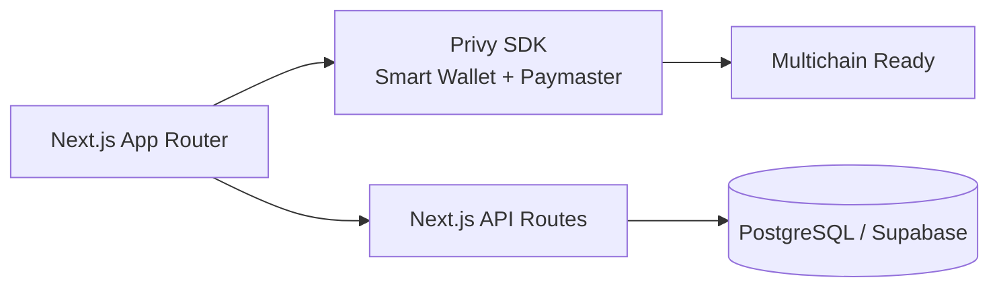

# Visión & Arquitectura

Swagly es un hub Web3 para experiencias en vivo (hackathons, meetups, festivales). El objetivo es simplificar la participación: el usuario solo conecta/crea wallet, escanea y reclama recompensas sin fricción de gas.

## Módulos del producto

- **Pasaporte y misiones**: flujos en `inicio`, `events` y `dashboard` muestran retos, niveles y progreso.
- **Tienda y merch**: `shop` lista productos y usa componentes con imágenes optimizadas y lazy load.
- **Perfil**: `profile` muestra stats y saldo TOKEN (usa `TokenBalance`).
- **Navegación responsive**: headers per-page con logo + CTA “Conectar” y menú mobile.

## Arquitectura técnica

- **Frontend**: Next.js 16 (App Router) + TypeScript + Tailwind/shadcn.
- **Estado**: hooks y React Query donde aplica.
- **Web3**: Privy (smart wallets, in-app wallet, paymaster) y viem.
- **Datos**: Prisma + PostgreSQL/Supabase (generación en `prisma generate`).
- **Infra**: Vercel + service worker/PWA listo.

## Identidad y wallets

- Smart accounts Nexus (ERC-4337) + paymaster para transacciones sin gas.
- In-App Wallet con login social (Google, Apple, Telegram, Passkey) y wallets tradicionales (via Privy).

## Token y recompensas

- Token interno TOKEN (tracking en UI) y puntos de actividad.
- Token del sponsor para recompensas paralelas en campañas específicas.
- Hooks/componente `TokenBalance` para mostrar saldo en headers mobile/desktop.

## Diseño y UX

- Paleta: azul `#5061EC`, amarillo `#FEE887`, verde CTA `#B5E86D`, fondos negros con blur.
- Logos PNG en `static/img/LogoSwagly.png` y `TextoLogoSwagly.png`.
- Imágenes críticas con `priority`, `sizes` y `object-cover/contain` para evitar CLS.
